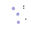
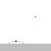
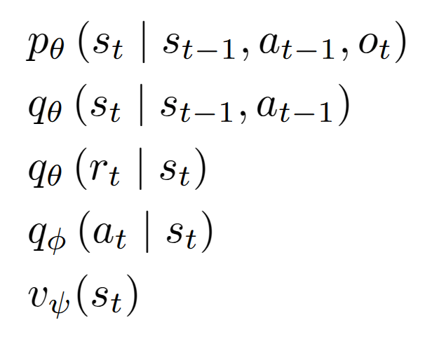
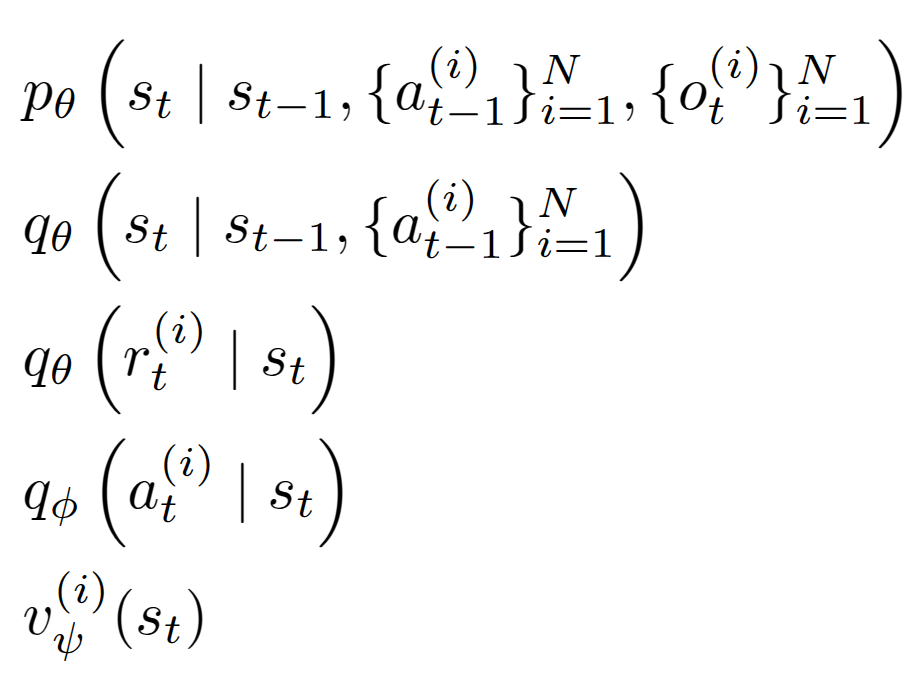
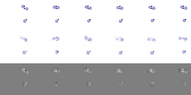
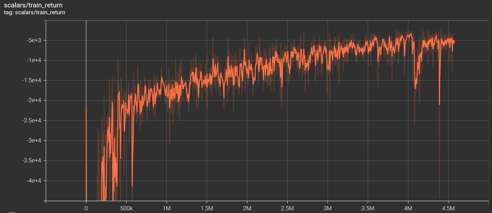

# Dreamers-torch
This is a pytorch implementation of Dreamers, a generalization of [Mastering Diverse Domains through World Models](https://arxiv.org/abs/2301.04104v1) to amulti agent environemnt. This repo is heavily built upon the work of [dreamerv3-torch](https://github.com/NM512/dreamerv3-torch)

<div align="center">
  
  
</div>

## Our contribution
This repo is nothing more than generlize single dreamer into multi dreamers withshared critic and world model.

<div align="center">
  <figure style="display: inline-block; margin: 10px;">
    
    <figcaption><em>Before : ingle Agent Dreamer</em></figcaption>
  </figure>
  <figure style="display: inline-block; margin: 10px;">
    
    <figcaption><em>After : multi Agent Dreamer</em></figcaption>
  </figure>
</div>

## Instructions

### Method 1: Manual

Get dependencies with python 3.11:
```
pip install -r requirements.txt
```
Run training on SimpleSpread (MPE game):
```
python dreamer.py --configs vmas --task vmas_simple_spread --logdir ./logdir/vmas_simple_spread
```
Monitor results:
```
tensorboard --logdir ./logdir
```

There you will see metric and gifs like the following predicted vs actual of world model.
<div align="center">
  
</div>

## Benchmarks
to be field 


### Simple Spread 
<div align="center">
  
</div>

### Balance
<div align="center">
  
</div>

## Acknowledgments
This code is heavily inspired by the following works:
- NM512 dreamerv3-torch : https://github.com/NM512/dreamerv3-torch
- danijar's Dreamer-v3 jax : https://github.com/danijar/dreamerv3
- danijar's Dreamer-v2 tensorflow : https://github.com/danijar/dreamerv2
- jsikyoon's Dreamer-v2 pytorch : https://github.com/jsikyoon/dreamer-torch
- RajGhugare19's Dreamer-v2 pytorch : https://github.com/RajGhugare19/dreamerv2
- denisyarats's DrQ-v2 original : https://github.com/facebookresearch/drqv2

# TODO
- Heavy refactor 
- Add explentation for vanila dreamers and mamba 
- Run on more enviroenmnt 
- explain current is not collaborate 
- Add link to presentation 
